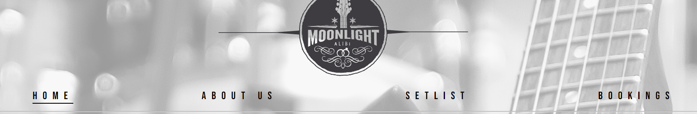
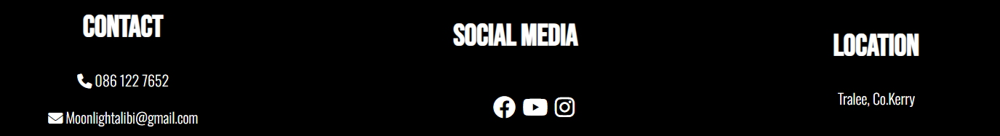

# Moonlight Alibi

Moonlight Alibi is a website for a Rock 'n' Roll wedding band. The website aims to entice the user to book the band for their wedding. View the live site here: <https://beccaob.github.io/moonlight-alibi>

## Website Mock-up

View all pages on the mock-up generator here <https://techsini.com/multi-mockup/index.php>

# Table of Contents

* [**Features**](#features)
* [**Design**](#design)
* [**Technologies**](#technologies)
* [**Testing**](#testing)
* [**Deployment**](#deployment)
* [**Credits**](#credits)

# **Features**

## Site Wide

### Navigation

* Contains links to the home, about, setlist & booking pages. Will be reponsive across all devices.
* This will enable users to easily navigate their way around the website on any device.

## Footer

* Will contain contact information and link to both phone & email which will automatically open their default mail/phone application and pre-fill the address/number bar.
* Will contain a band location so users will easily know where to locate Moonlight Alibi.
* Will contain links to social media where the user can get more information on the band. All links will have aria labels to assist screen readers and each link will open in a new tab.

## Favicon

* Sitewide favicon will be enabled with Moonlight Alibi's logo.

* This will show an image in the tabs header will allow the user to clearly indentify the site if they have multiple tabs open.

