# Moonlight Alibi

Moonlight Alibi is a website for a Rock 'n' Roll wedding band. The website aims to entice the user to book the band for their wedding. View the live site here: <https://beccaob.github.io/moonlight-alibi>

## Website Mock-up

# Table of Contents

* [**Features**](#features)
* [**Design**](#design)
* [**Technologies**](#technologies)
* [**Testing**](#testing)
* [**Deployment**](#deployment)
* [**Credits**](#credits)

# **Features**

## Site Wide

### Navigation

* Contains links to the home, about, setlist & booking pages. Will be reponsive across all devices.
* This will enable users to easily navigate their way around the website on any device.

## Footer

* Will contain contact information and link to both phone & email which will automatically open their default mail/phone application and pre-fill the address/number bar.
* Will contain a band location so users will easily know where to locate Moonlight Alibi.
* Will contain links to social media where the user can get more information on the band. All links will have aria labels to assist screen readers and each link will open in a new tab.

## Favicon

* Sitewide favicon will be enabled with Moonlight Alibi's logo.

* This will show the logo image in the tabs header which will allow the user to clearly indentify the site if they have multiple tabs open.

## Landing Page
### Landing Page Images

* The landing page features a background image of a guitar and drum set. This makes the site feel cohesive and elimnates the stark white background. 
* The Logo image is featured at the top of every page - this allows the user to know what site they are visiting.
* The hero image is a group of wedding guests enjoying the music - this image is accompanied by a snippet of who Moonlight Alibi are. This informs the user of the websites purpose right away. This text also has a link to the setlist page where the user can learn more information about the music Moonlight Alibi perform. 

### Promises Section

* This section aims to inform the user of Moonlight Alibi's work ethic in the hopes of getting them to enquire about a booking. There is an enquiry button below the promises section that links to the booking page to aid this. 

## About Us Page 

### About Us Content 

* The about us content aims to allow the user to learn more about Moonlight Alibi. It will also contain a review from a previous client to showcase the bands talent and professionalism. This in turn may entice the user to book with the band. 

## Setlist Page 

### Setlist Headings 

* What Makes Us Different : This allows the user to see why Moonlight Alibi is unique. It informs the user that they are not your typical wedding band - they only play Rock n Roll. 
* Reception, After-Party & Day Two: These sections aim to show the user the type of music that the band plays. Spoiify tracks will be embedded into the page which the user can play if they wish to really get a feel for the bands sound. In time, these spotify tracks will be replaced with actual band recordings. 

## Bookings Page 

* The sign up page will consist of a form complete with all fields necessary to gather relevant information. Such as:
  * Name (type=text)
  * Email ( type=email)
  * Mobile Number (type=number)
  * Date of event ( type=date )
  * Service Choice ( type= checkbox ) ( allows user to pick more than one.)
* The purpose of this form is to allow the user to get in contact with Moonlight Alibi.
* There is a link back to the setlist page if the user wishes to refresh their knowledge on the services offered - this will open in a new tab so the user does not lose any form data they have already entered.
* There is a submit button to submit the form and a reset button to reset all data.

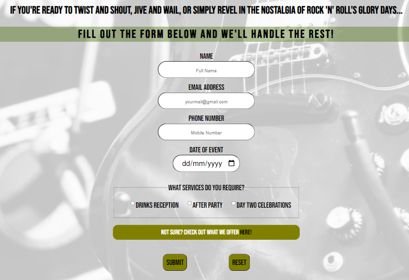

* Upon completion, the user will be redirected to contact.html where they will be met with a Submission successful message. 
* The purpose of this message is to inform the user that their submission has been successful. 

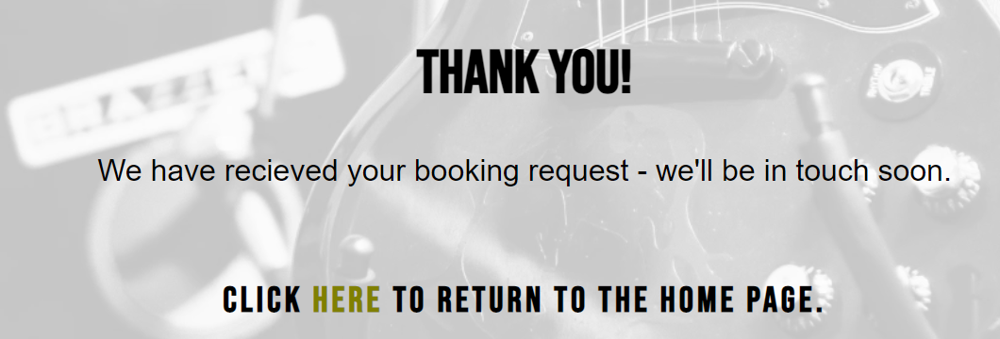

## Existing Features 

* Responsive Design 
* Contact form & success page
* 404 page

## Features Left to Implement 
* As a future enhancement, the contact form will be updated with JavaScript. This will send an email to Moonlight Alibi with the users contact information. 
* Animation to be added to hero image.
* Gallery to be added with photos from previous weddings.
* Spotify tracks to be replaced with band recordings. 

## Target Audience

* Moonlight Alibi's target audience are engaged couples who love Rock n roll music and couples who want something different for their wedding entertainment. 

## User Stories

1. Jane  
Jane wants to know more about Moonlight Alibi after finding their website.
Wants To: Know more about the band.
End Goal: Feel Informed

Outcome: Jane can feel informed after visiting the About Us section of the site.

2. Robert
Robert wants to see what type of music Moonlight Alibi play.
Wants To: Hear music.
End Goal: Feel Informed

Outcome: Robert can feel informed by visiting the 'Setlist' page and listening to the embedded spotify tracks.

3. Marie
Marie wants to book Moonlight Alibi for her wedding day.
Wants to: Book the band.
End Goal: Contact the band

Outcome: Marie can contact the band by filling out the booking form.

# Design 

## Site Wide

### Colours

The colours used will be Olive ( element background colour ) and black ( Primary heading & content colour ).
Black & White hero & background images will be used to keep the design consistent, professional and classy.

### Fonts

Fonts used will be Oswald & Bebas Neue - these were chosen to keep in line with the logo font. They will be linked in the html file from Google Fonts.

## Wireframes

* I designed a wireframe to give myself a rough idea of what I wanted the site to look like.
* I did this to save myself time by not designing as I go.
* The wireframe was a rough guideline from project inception so they do not match exactly.

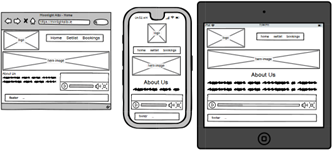

# **Technologies**

## HTML

* The websites structure was developed using HTML as the main language.

## CSS

* The website was styles using custom CSS in an external file.

## Code Anywhere

* The website was developed using Code Anywhere.

## Github

* Source code is hosted on Github & deployed using Git Pages.

## Git

* Used to commit and push code throughout the development process.

## Font Awesome

* Icons from <https://fontawesome.com/> were used in the promise section, social media and contact icons on the site.

## Google Fonts

* Fonts were linked to the HTML file from Google Fonts.

## Favicon.io

* Favicon files were created using <https://favicon.io>

## Balsamiq

* Wireframes were created using Balsamiq from <https://balsamiq.com/wireframes/desktop/>

## NVDA

* Manual accessibility text ran using NDVA. (<https://www.nvaccess.org/>)

## Images

* Images were created using Canva Pro from <https://www.canva.com/>

# **Testing**

## Responsiveness

All pages were tested to ensure responsiveness on screen sizes from 320px upwards. Each page was tested on Chrome, Edge and Firefox.

Steps to test:

1. Open the browser and navigate to [Moonlight Alibi](https://beccaob.github.io/moonlight-alibi/index.html)
2. Open the developer tools ( right click & inspect )
3. Set to responsive & decrease width to 320px
4. Set the zoom to 50%
5. Click & drag window to max width

Expected Outcome:

* Responsive on all screen sizes, no pixelated/stretched images
* No horizontal scroll bar
* No element overflow

Actual Outcome:

The website behaved as expected across all tests. Although, the background image on mobile was quite streched. I did not have time to fix this issue but I am aware that it's there and aim to fix it in the near future.

The site was also tested on the following devices and no issues were detected:

* Apple IPhone 13
* Asus 15.6" M509DA-EJ034T

## **Accessibility**

[Wave Accessibility Tool](https://wave.webaim.org/) was used throughout development and for the final testing of the website. No issues were reported. 

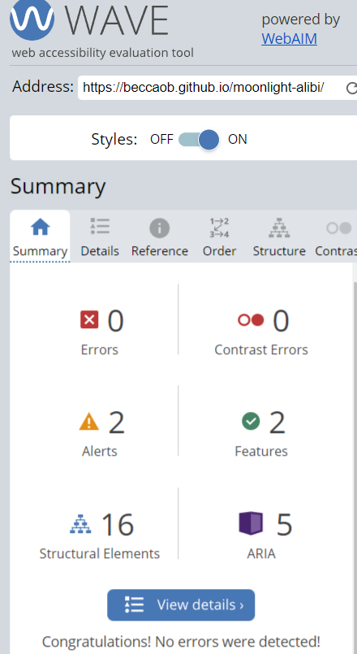

Testing was targeted towards ensuring the following criteria was met: 
* All forms have associated labels so it's read out on a screen reader to users who tab to form inputs.
* Color contrasts meet the minimum requirements specified in WCAG Contrast Guidelines. 
* All content is contained within landmarks to allow the user to navigate by page region.
* Heading levels are not skipped or missed. This will ensure the importance of content is conveyed to the user. 
* All images have alt attributes or titles so screen readers can read the description to the user. 
* HTML page language has been set.  

## Lighthouse Testing 

* Home Page 

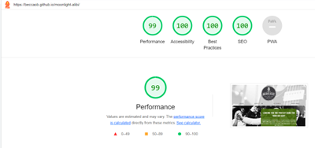

* About Us Page 

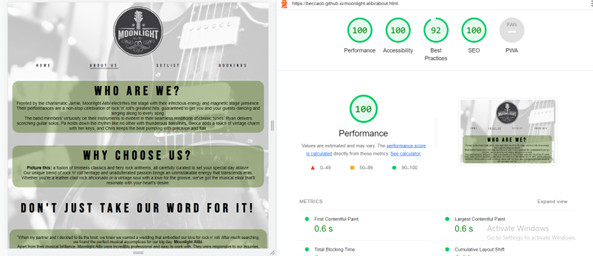

* Setlist Page 

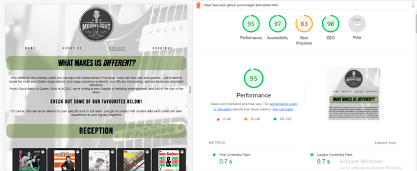

* Booking Page 

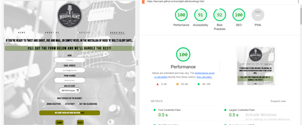

## **Functional Testing**

### Nav Links

Testing was performed to ensure links on all pages navigated to the correct place as per design. This was done by clicking on the nav links on each page ( menu & footer )

Expected Outcome:

* All links navigate to correct page

Actual Outcome:

* Outcome as expected

### Form Testing

The booking form was tested to ensure it performed as expected when correct/incorrect data was inputted. The following tests were performed:

#### **Correct Inputs**

Steps to test:

1. Navigate to {Booking Moonlight Alibi}(<https://beccaob.github.io/moonlight-alibi/bookings.html>)
2. Input the following data:
    * First Name: Jane
    * Email: j.doe@test.com
    * Number: 0861227652
3. Choose checkbox
4. Click 'Submit'
5. User should be redirected to contact.html confirmation page

Expected:

* Form submits with no errors and user is redirected to confirmation page mentioned above.

Actual:

* Website behaved as expected with no errors/warnings and user was redirected correctly.

#### **Missing Name Input**

Steps to test:

Steps to test:

1. Navigate to {Booking Moonlight Alibi}(<https://beccaob.github.io/moonlight-alibi/bookings.html>)
2. Input the following data:
    * First Name: Jane
    * Email: j.doe@test.com
    * Number: 0861227652
3. Choose checkbox
4. Click 'Submit'
5. User should be redirected to contact.html confirmation page

Expected:

* Form doesn't submit & an error is displayed. User is not redirected to confirmation page mentioned above.

Actual:

* Website behaved as expected, error message was displayed and the form didn't submit. User was not redirected to confirmation page.

#### **Incorrect email format in Email input**

1. Navigate to {Booking Moonlight Alibi}(<https://beccaob.github.io/moonlight-alibi/bookings.html>)
2. Input the following data:
    * First Name: Jane
    * Email: j.doe-test.com
    * Number: 0861227652
3. Choose checkbox
4. Click 'Submit'
5. User should be redirected to contact.html confirmation page

Expected:

* Form doesn't submit & an error is displayed. User is not redirected to confirmation page mentioned above.

Actual:

* Website behaved as expected, error message was displayed and the form didn't submit. User was not redirected to confirmation page.

## **Footer Social Icons**

Testing was performed on the social media icons to ensure each opened in a new tab.

As expected, each icon opened in a new tab.

## **Footer Contact Information**

Testing was performed on the email in the 'Contact Us' section of the footer to ensure it opened the users default mail application.

Steps to test:

1. Navigate to {Moonlight Alibi}(<https://beccaob.github.io/moonlight-alibi/index.html>)
2. Click the email address in the footer ( moonlightalibi@gmail.com )

Expected:
Default mail application is opened and 'To' address bar is pre-filled.

Actual: Behaviour was as expected.

## Validator Testing 

* HTML: 

Home:
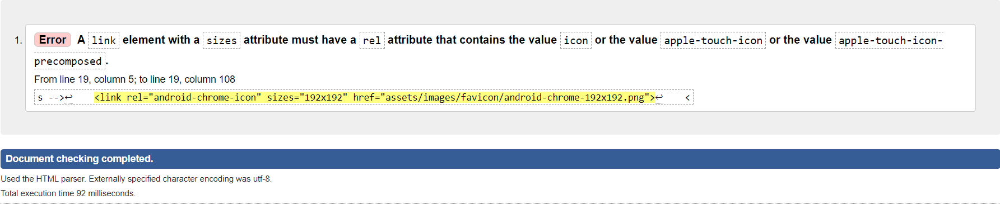

The only error i recieved is from the favicon icons. I believe this is out of the scope of this course but I plan on fixing it once I know more. 

About & Booking: The same error was received on the about page. Again, I believe this is out of the scope of this course but I plan on fixing it once I know more. 

Setlist: 
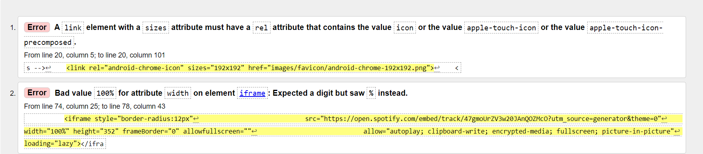

The above errors were received on the setlist page. I believe this is out of the scope of this course but I plan on fixing it once I know more. The spoitfy tracks were embedded using spotifys embed feature. 

* CSS

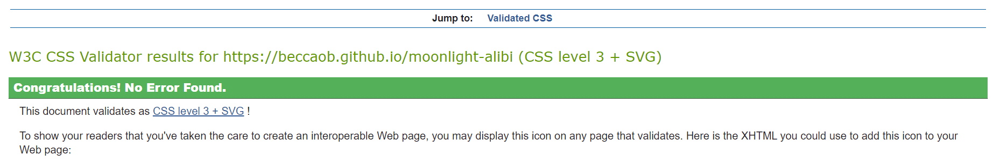

# **Deployment**

The website was created using Code Anywhere editor and pushed to the github remote repository 'moonlight-alibi'
The following git commands were used throughout development to push code to the remote repository:

* git add .
  * This command was used to add a change in the working directory to the staging area.

* git commit -m "commit message"
  * This command was used to commit changes to the local repo queue ready to be pushed to the remote repo.

* git push
  * This command was used to push all committed code to the remote repo on github.

## Deployment to Github Pages

The site was deployed to Github Pages. Steps used are as follows:

1. In the repo, open the settings tab
2. In left menu, click 'Pages'
3. From the source section, select 'Branch:main' from the dropdown menu
4. Click 'Save'
5. A live link will be displayed in green banner when published successfully

The live link to Moonlight Alibi can be found here: <https://beccaob.github.io/moonlight-alibi/>

## Clone Repo Code Locally

Navigate to the github repo you want to clone for local use

1. Click the 'Code' drop down menu
2. Click on 'HTTPS'
3. Copy the repo link to the keyboard
4. Open preferred integrated development environment (IDE)

(Git must be installed for the final step)

5. Type git clone copied-git-url into the IDE terminal

The project will now be cloned on your local machine.

# **Credits**

## Images - Canva

* Home Background Image: 'Musical instruments in modern music studio' - DmiTry

* Hero Image: 'Groom and wedding guests laughing during party' - FG Trade

* Logo : Moonlight Alibi - Pa Lynch

## Spotify

* Used to embed tracks in Setlist Page.

## Font Awesome

* Icons from <https://fontawesome.com/> were used in the promise section, contact and social media icons on the site.

## Google Fonts

* Fonts were linked to the HTML file from Google Fonts.

## Favicon.io

* Favicon files were created using <https://favicon.io>

## Balsamiq

* Wireframes were created using Balsamiq from <https://balsamiq.com/wireframes/desktop/>

## NVDA

* Manual accessibility text ran using NDVA. (<https://www.nvaccess.org/>)

## Flexbox Froggy

* Used to re-familiarize myself with using flexbox.
  * <https://flexboxfroggy.com/>

## Unicorn Revealer

* Chrome extension used to highlight overflow.
  * Can be downloaded here: <https://chrome.google.com/webstore/detail/unicorn-revealer/lmlkphhdlngaicolpmaakfmhplagoaln?hl=en-GB>

## Multi Device Website Mock-up Generator

* Used to test responsiveness on Apple devices. Screenshotted for readme.md file.
  * Can be accessed here: <https://techsini.com/multi-mockup/>

## Code Institute Sample README.md

* Used as a template to create README.md for the wesbite.
  * Can be accessed here: <https://github.com/Code-Institute-Solutions/readme-template>

## Github Markdown Cheat Sheet

* Used to assist in writing README.md
  * Can be accessed here: <https://docs.github.com/en/get-started/writing-on-github/getting-started-with-writing-and-formatting-on-github/basic-writing-and-formatting-syntax>

# Thank You

Thanks to my fellow peers for reviewing my project and a very special thank you to my mentor Jack Wachira , for his invaluable advice and resources throughout the development of this project.

