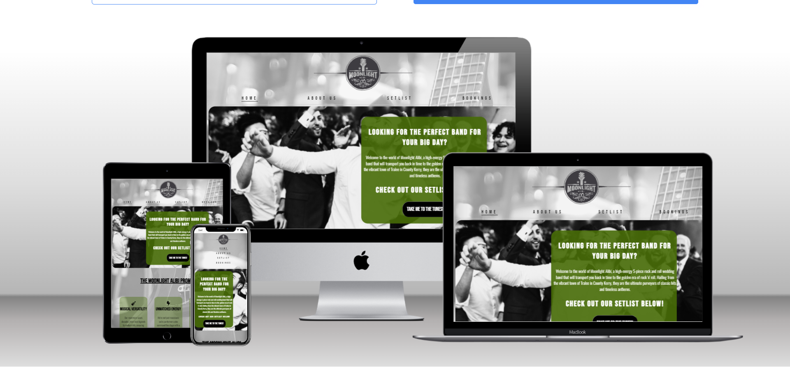
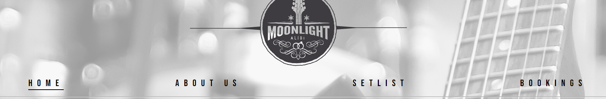
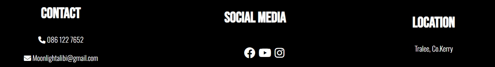
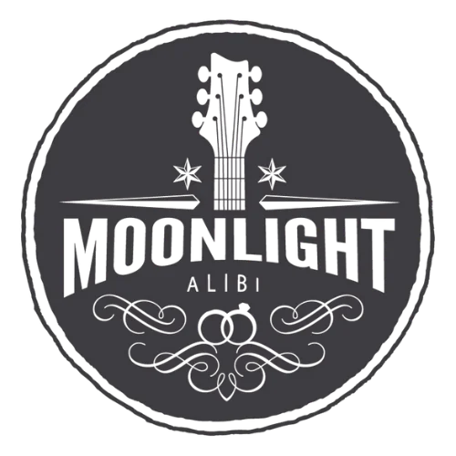
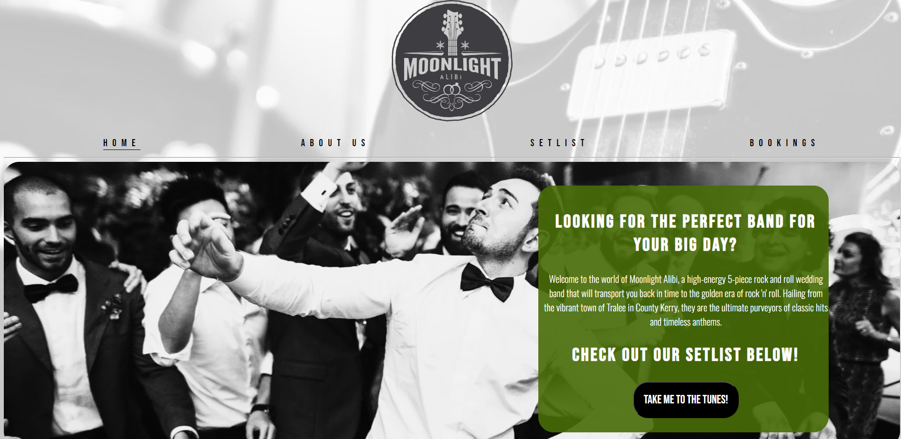
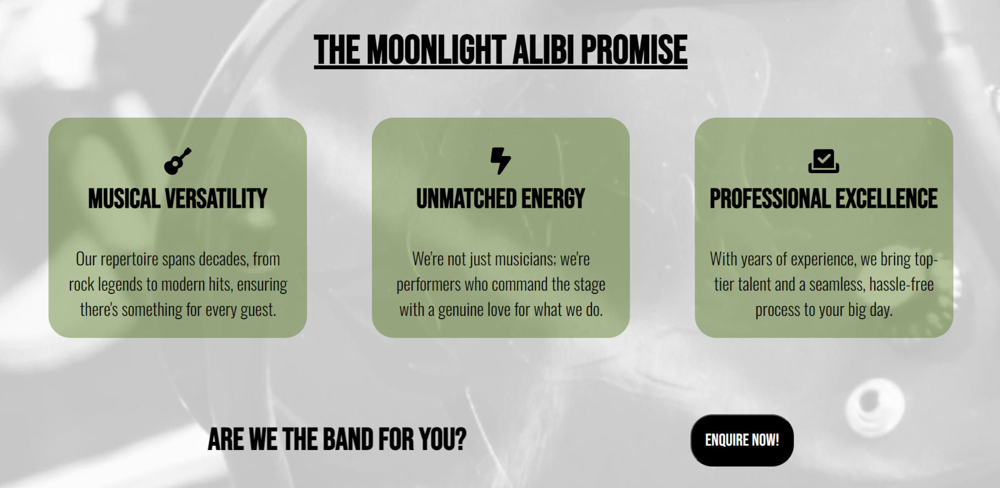
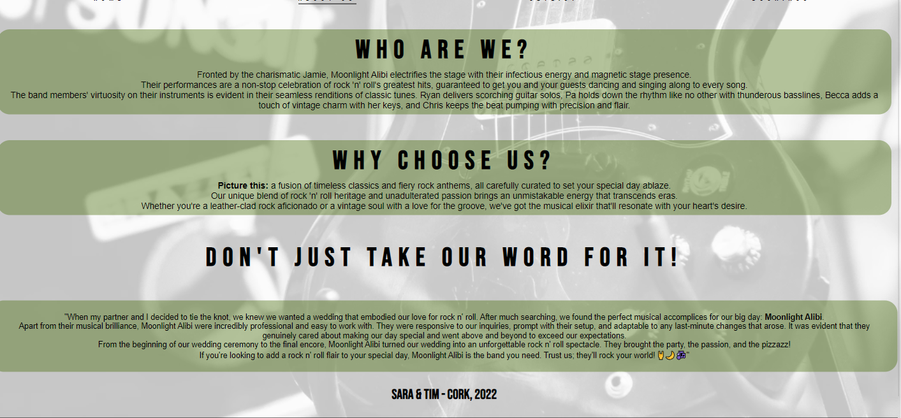

# Moonlight Alibi

Moonlight Alibi is a website for a Rock 'n' Roll wedding band. The website aims to entice the user to book the band for their wedding. View the live site here: <https://beccaob.github.io/moonlight-alibi>

## Website Mock-up

# Table of Contents

* [**Features**](#features)
* [**Design**](#design)
* [**Technologies**](#technologies)
* [**Testing**](#testing)
* [**Deployment**](#deployment)
* [**Credits**](#credits)

# **Features**

## Site Wide

### Navigation

* Contains links to the home, about, setlist & booking pages. Will be reponsive across all devices.
* This will enable users to easily navigate their way around the website on any device.

## Footer

* Will contain contact information and link to both phone & email which will automatically open their default mail/phone application and pre-fill the address/number bar.
* Will contain a band location so users will easily know where to locate Moonlight Alibi.
* Will contain links to social media where the user can get more information on the band. All links will have aria labels to assist screen readers and each link will open in a new tab.

## Favicon

* Sitewide favicon will be enabled with Moonlight Alibi's logo.

* This will show the logo image in the tabs header which will allow the user to clearly indentify the site if they have multiple tabs open.

## Landing Page
### Landing Page Images

* The landing page features a background image of a guitar and drum set. This makes the site feel cohesive and elimnates the stark white background. 
* The Logo image is featured at the top of every page - this allows the user to know what site they are visiting.
* The hero image is a group of wedding guests enjoying the music - this image is accompanied by a snippet of who Moonlight Alibi are. This informs the user of the websites purpose right away. This text also has a link to the setlist page where the user can learn more information about the music Moonlight Alibi perform. 

### Promises Section

* This section aims to inform the user of Moonlight Alibi's work ethic in the hopes of getting them to enquire about a booking. There is an enquiry button below the promises section that links to the booking page to aid this. 

## About Us Page 

### About Us Content 

* The about us content aims to allow the user to learn more about Moonlight Alibi. It will also contain a review from a previous client to showcase the bands talent and professionalism. This in turn may entice the user to book with the band. 

## Setlist Page 

### Setlist Headings 

* What Makes Us Different : This allows the user to see why Moonlight Alibi is unique. It informs the user that they are not your typical wedding band - they only play Rock n Roll. 
* Reception, After-Party & Day Two: These sections aim to show the user the type of music that the band plays. Spoiify tracks will be embedded into the page which the user can play if they wish to really get a feel for the bands sound. In time, these spotify tracks will be replaced with actual band recordings. 

## Bookings Page 

* The sign up page will consist of a form complete with all fields necessary to gather relevant information. Such as:
  * Name (type=text)
  * Email ( type=email)
  * Mobile Number (type=number)
  * Date of event ( type=date )
  * Service Choice ( type= checkbox ) ( allows user to pick more than one.)
* The purpose of this form is to allow the user to get in contact with Moonlight Alibi.
* There is a link back to the setlist page if the user wishes to refresh their knowledge on the services offered - this will open in a new tab so the user does not lose any form data they have already entered.
* There is a submit button to submit the form and a reset button to reset all data.

[booking](assets/images/README-images/booking.png)

* Upon completion, the user will be redirected to contact.html where they will be met with a Submission successful message. 
* The purpose of this message is to inform the user that their submission has been successful. 

[contact](assets/images/README-images/contact-page.png)

## Existing Features 

* Responsive Design 
* Contact form & success page
* 404 page

## Features Left to Implement 
* As a future enhancement, the contact form will be updated with JavaScript. This will send an email to Moonlight Alibi with the users contact information. 
* Animation to be added to hero image.
* Gallery to be added with photos from previous weddings.
* Spotify tracks to be replaced with band recordings. 

## Target Audience

* Moonlight Alibi's target audience are engaged couples who love Rock n roll music and couples who want something different for their wedding entertainment. 

## User Stories

1. Jane  
Jane wants to know more about Moonlight Alibi after finding their website.
Wants To: Know more about the band.
End Goal: Feel Informed

Outcome: Jane can feel informed after visiting the About Us section of the site.

2. Robert
Robert wants to see what type of music Moonlight Alibi play.
Wants To: Hear music.
End Goal: Feel Informed

Outcome: Robert can feel informed by visiting the 'Setlist' page and listening to the embedded spotify tracks.

3. Marie
Marie wants to book Moonlight Alibi for her wedding day.
Wants to: Book the band.
End Goal: Contact the band

Outcome: Marie can contact the band by filling out the booking form.
